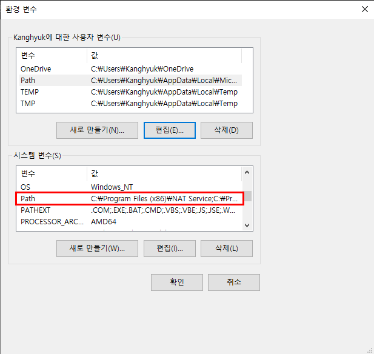

환경변수 `Path` 에 특정 경로를 추가
-



```bash
setx /m Path "%Path%;경로"
```

* 주의 : 관리자 권한 수준에서만 사용이 가능하다. (`sudo`)

* 주의 : 환경변수가 많아서 1024자를 넘기면 잘린다. 기존 값이 변경될 수도 있으니 필히 확인하자.
* `set 변수` 명령어는 현재 명령 프롬프트 창에서만 사용할 수 있는 환경 변수를 선언한다.
* `/m` 인수가 없으면 사용자 수준 경로 변수만 변경하거나 만든다.
* `%변수%`는 기존에 등록되어 있던 값을 반환한다.
  - `시스템 변수`와 `사용자 변수`에 동일한 이름이 있을 경우 `시스템 변수` 의 우선순위가 높다.

-----

예약 변수 ([Reserved Variable])
-

* 미리 값을 가지고 있는 변수
* 해당 변수명으로 쓰기를 하면 오류가 발생할 수 있다.
* `%변수%`(Windows) `$변수`(Linux) 형식으로 사용한다.

* 아래 명령어 공부하기
C:\work> find . -name "*.[ch]" | sed -e "/svn/d" | less

[Reserved Variable]: https://blog.gaerae.com/2015/01/bash-hello-world.html