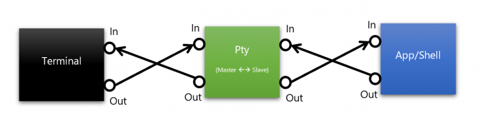
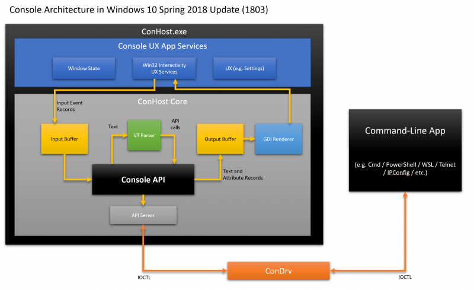
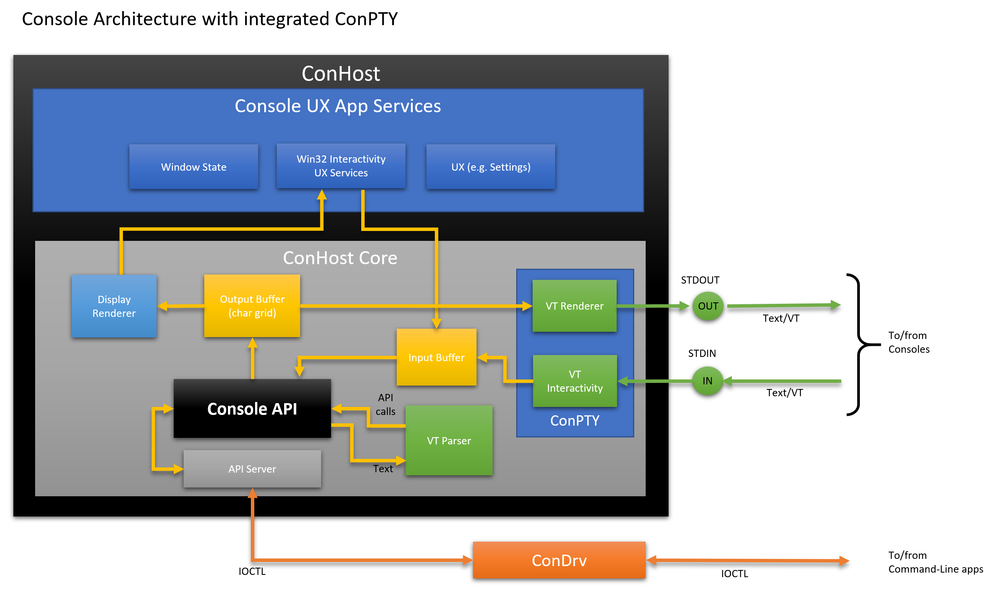
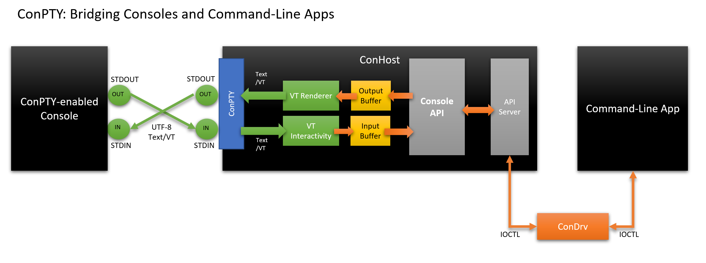
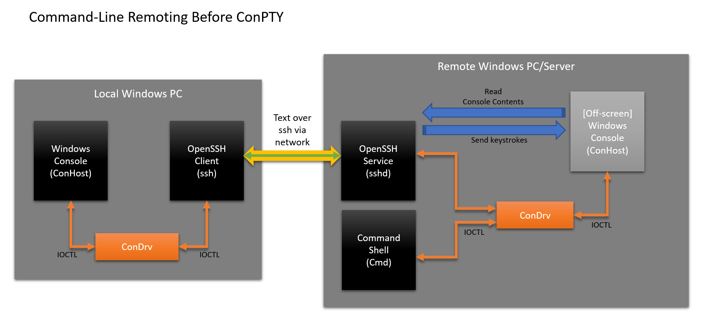
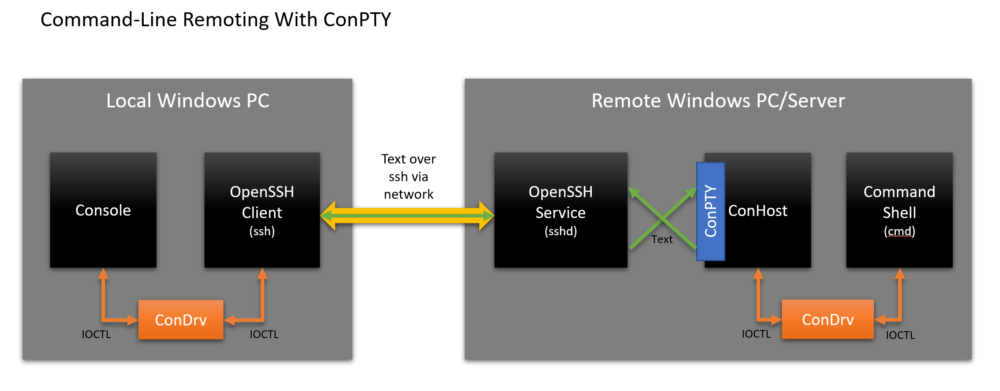

- [Reference](#reference)
- [Terminal](#terminal)
- [Console](#console)
- [Shell](#shell)
- [Command Line, and Shell](#command-line-and-shell)
- [Modern Command-Line](#modern-command-line)
- [Pseudo Console, Pseudo Terminal, PTY, Pseudo TTY (ConPTY)](#pseudo-console-pseudo-terminal-pty-pseudo-tty-conpty)
- [Kernel vs Shell](#kernel-vs-shell)

---
# Reference

  - [What's the difference between a console, a terminal, and a shell?](https://www.hanselman.com/blog/whats-the-difference-between-a-console-a-terminal-and-a-shell)
  - [Introducing the Windows Pseudo Console(ConPTY)](https://devblogs.microsoft.com/commandline/windows-command-line-introducing-the-windows-pseudo-console-conpty/)
  - [Difference Between Kernel and Shell](https://jaguhiremath62.medium.com/difference-between-kernel-and-shell-718b3de15be6)

---
# Terminal

  - `Terminate` 단어에서 유래하여 프로세스의 종료 또는 `터미널`의 끝을 나타낸다.
  - `TTY` 또는 `Teletypewriter`가 최초의 터미널이었다.
  - 소프트웨어적인 의미에서 터미널은 `TTY` 또는 터미널의 소프트웨어 환경을 의미한다.
    - 쉘을 래핑한 프론트엔드 프로그램이라고 할 수 있다.
  - 텍스트 출력에 특화되어 있고 해당 입력의 의미는 생각하지 않는다.
  - `시리얼 또는 소켓을 통한 컴퓨터나 전용 장치의 원격 세션` 이라는 의미로도 사용한다.

---
# Console

  - 20세기 중반의 사람들이 거실에 `콘솔` 또는 `콘솔 캐비닛` 이라는 가구를 가지고 있었다.
  - 컴퓨터 문맥 상 콘솔은 화면과 키보드가 결합된 콘솔 또는 캐비닛을 의미한다.
  - 소프트웨어적 의미로 터미널과 콘솔은 동의어다. 요새는 `물리적으로 연결되어 있는 입출력도구` 라는 의미로도 사용한다.
    - = physical terminal

---
# Shell

  - 터미널이 받은 입력을 OS에 보내는 프로그램이다.
  - 입력을 받으면 쉘은 출력을 생성하여 디스플레이를 위해 다시 터미널에게 전달한다.
  - `bash`, `tsch`, `sh`, `PowerShell`, `pwsh`, `cmd`, `yori`, `4dos` 등이 있다.
  - 쉘의 선택이 터미널 응용프로그램의 선택을 강요하지 않는다. 즉, 독립되어 있다.
    - 터미널은 쉘을 사용하지만, 쉘은 터미널 없이 동작 가능하다.
  - OS 서비스를 유저에게 보여주는 인터페이스 (다른 정의)

---
# Command Line, and Shell

  - `Command-Line` 또는 `CLI(Command Line Interface/Interpreter)` 는 사람이 컴퓨터를 사용하는 가장 기본적인 메커니즘을 말한다.
    - 입력을 받아들이고 요청된 명령을 수행한다.
  - 점점 더 정교한 일을 하는 명령어를 처리하기 위해서 커맨드라인 프로세스가 `shells` 으로 진화했다.
  - 오리지날 `UNIX shell(sh)`은 `Korn shell(ksh)`, `C shell(csh)`, `Bourne shell(sh)`에게 영향을 주었으며 `Bourne Again shell (bash)`의 시초가 되었다.
  - `Microsoft` 시리즈들에서는 아래와 같이 변경되었다.
    - `MS-DOS(command.com)`는 비교적 단순한 커맨드라인 쉘이다.
    - `Windows NT`의 `명령 프롬프트(cmd.exe)`는 기존 `MS-DOS`와 호환되면서 강력한 OS를 위한 몇가지 추가 명령을 가지고 있다.
    - 2006년에 `.NET CLR, .NET Framework` 기능을 기반으로 구축한 오브젝트 기반 커맨드라인 쉘 `Windows PowerShell`이 출시되었다.
      - 파일/스트림 기반이 아니라 객체 지향 쉘이다.
      - 텍스트 스트림 대신 객체 스트림을 처리하여 많은 스크립트를 작성하고 유지, 관리할 필요가 없다.
    - 2016년에 `Windows Subsystem for Linux (WSL)`을 출시하여 리눅스 바이너리를 윈도우에서 직접 실행할 수 있도록 만들었다.
      - 이중 부팅이나 가상 머신을 사용하지 않고도 리눅스 커맨드라인 툴을 사용할 수 있다.

---
# Modern Command-Line

  - 여전히 예전에 사용하던 기계식 텔레타이프 머신과 동일한 기능들을 수행한다.
  - 하지만 느린 TTY 시리얼 통신 회선 대신 프로그램들은 매우 빠르고 메모리 안에 있는 `Pseudo Teletype (PTY)` 통신을 통해 데이터를 주고받는다.
  - 주로 로컬에서 실행되는 커맨드라인 프로그램과 통신하지만, 로컬 네트워크나 인터넷을 통해 원격 컴퓨터와 통신할 수 있다.

---
# Pseudo Console, Pseudo Terminal, PTY, Pseudo TTY (ConPTY)

  - 터미널을 에뮬레이트하는 터미널 에뮬레이터 또는 소프트웨어 인터페이스
  - 동일한 컴퓨터에서 실행되는 서로 다른 응용프로그램들의 통신을 위해 `Pseudo Terminal (PTY)`이 도입되었다.
  - `PTY`는 컴퓨터의 시리얼 통신 하드웨어를 가상화하여 `Master, Slave Pseudo-device`를 만든다.
  - 터미널 앱은 `Master Pseudo-device`에 연결되고 `cmd, PowerShell, bash`와 같은 커맨드라인 프로그램(쉘)은 `Slave Pseudo-device`에 연결된다.
  - 응용 프로그램에서 보낸 텍스트는 슬레이브에 전송된 다음 마스터, 터미널 순으로 라우팅된다.
    - `슬레이브`는 `물리적 터미널 장치`의 동작을 에뮬레이트하고 문자를 `POSIX` 신호로 변환한다.
      - 사용자가 터미널에 `ctrl + c`를 입력하면, `ASCII`값  `ctrl + c(0x03)`가 `마스터`를 통해 `슬레이브`로 전송된다. `슬레이브`가 수신하면 값이 입력 스트림에서 제거되고 `SIGINT` 신호가 생성된다.
  - 데이터는 항상 `비동기`로 전송/수신 된다.
  - `UNIX` 시스템에서 터미널 프로그램은 `PTY`의 마스터, 슬레이브 한 쌍의 `파일 설명자(File Descriptors)`를 반환하는 `openpty()`를 호출한다.
    - 이후에 `bash`와 같은 차일드 커맨드라인 프로그램을 `fork / exec` 할 수 있으며, 슬레이브 `fd`를 사용하여 연결된 터미널로 텍스트를 수신하고 반환한다.

      

  - `Windows Console`은 개념적으로는 `UNIX` 시스템과 비슷하다.
    - `Windows`는 `PTY` 인프라가 없다. 사용자가 커맨드라인 프로그램(`cmd, PowerShell, WSL, ipconfig...`)을 시작하면 `Windows`가 알아서 콘솔 인스턴스에 앱을 연결한다.
    - `Windows`가 서드파티 콘솔과 서버 앱을 차단한다. 커맨드라인 앱과 통신을 할 수 있는 파이프가 터미널에 없다. (?)
    - `Windows`에만 `Console API`가 존재한다. 다른 플랫폼은 API 대신 `text/VT`를 사용해야 하기 때문에 코드 이식성이 떨어진다.
    - `Windows Command-line Remoting`은 표준 이하다. API 의존성 떄문에 `interop, remoting` 시나리오를 방해한다.
  - `PTY`와 유사한 메커니즘을 요청하는 개발자가 많아 `Windows Pseudo Console(ConPTY)`를 만들었다.
    - `ConHost`는 콘솔 프로그램 그자체를 구현하면서 대부분의 커맨드라인 인프라 대부분을 포함하고 있다.
      - 모든 커맨드라인 프로그램 및 그것과 통신하는 GUI 프로그램을 모두 지원하는 진정한 의미의 `Console Host`가 되었다.
  - `ConPTY` 도입 이전과 이후 아키텍쳐 비교

`Console Architecture in Windows without ConPTY`

  
`Console Architecture in Windows with ConPTY`

  - `Windows` 콘솔, 커맨드라인 프로그램 작동방식
    - 사용자가 `cmd, PowerShell, ssh`와 같은 커맨드라인 앱을 시작할 때마다 `Windows`는 앱의 바이너리 파일과 종속성(리소스 또는 라이브러리)을 로드하는 새로운 `Win32` 프로세스를 생성한다.
    - 프로세스는 부모로부터 `stdin/stdout` 핸들을 상속, 커맨드라인 앱과 콘솔의 통신은 `kernel-mode Console Driver(ConDrv)`를 통해 전송된다.
      - `Windows GUI` 프로세스인 경우 `stdin/stdout` 핸들이 없기 때문에 새 콘솔 인스턴스에 연결한다.(?)
      - 사용자 권한의 `PowerShell` 인스턴스에서 시작하면 새 앱 프로세스는 부모의 `stdin/stdout` 핸들을 상속하기 때문에 부모와 동일한 콘솔에서 입/출력 처리를 한다.
      - `ConDrv`는 직렬화된 API 요청이나 텍스트 데이터가 포함된 `IOCTL` 메시지를 송/수신 한다.
    - 결론은, 커맨드라인 앱/쉘이 시작되면 `Windows`는 `ConDrv`를 통해 콘솔 인스턴스(`ConHost.exe`)에 앱을 연결한다.
  - `ConHost`의 작업 순서는 아래와 같다.
    - 사용자가 생성한 `KEY_EVENT_RECORD`나 `MOUSE_EVENT_RECORD`가 입력 버퍼에 저장된다.
    - 입력 버퍼는 한번에 하나의 레코드를 비우고 화면에 입력 작업(텍스트 그리기, 커서 이동, 텍스트 복사/붙여넣기 등)을 수행한다.
    - 작업 중 출력 버퍼의 내용이 변경된 경우 이 영역은 `ConHost`의 상태 엔진에 의해 기록된다.
    - 콘솔은 프레임마다 `OutputBuffer`의 변경된 영역을 디스플레이에 렌더링한다.
  - 커맨드라인 앱이 콘솔 API를 호출하면, `IOCTL` 메시지로 직렬화되고 `ConDrv`를 통해 전송된다.

    

  - 원격 컴퓨터의 인스턴스와 상호작용을 하기 위해서는 일종의 통신 브로커가 필요하다.
    - 브로커는 네트워크 연결을 통해 데이터를 투명하게 직렬화하고 인스턴스의 수명주기를 관리한다.
  - `Windows PowerShell`은 `OpenSSH`를 브로커로 사용한다.
  - `ConPTY` 도입 이전과 이후 아키텍쳐 비교

`Remoting Architecture without ConPTY`

  
`Remoting Architecture with ConPTY`

  - TODO : 자세한 처리방법 알아보기

---
# Kernel vs Shell

  - 커널은 `시스템의 모든 작업을 제어하는 OS의 핵심` 이다.
    - 종종 운영 체제를 의미하기도 한다.
    - 커널의 중요한 코드들은 다른 프로그램으로부터 보호하기 위해 특수 메모리 영역에 저장된다.
    - 프로세스 관리, 하드웨어 장치 관리, 메모리 관리, 파일 처리 및 스케쥴링, 인터럽트 처리 등을 수행한다.
  - 쉘은 `사용자가 커널과 통신할 수 있는 인터페이스` 이다.
    - 사용자가 쉘에 명령을 입력하면 해석하여 필요한 작업을 수행한다.