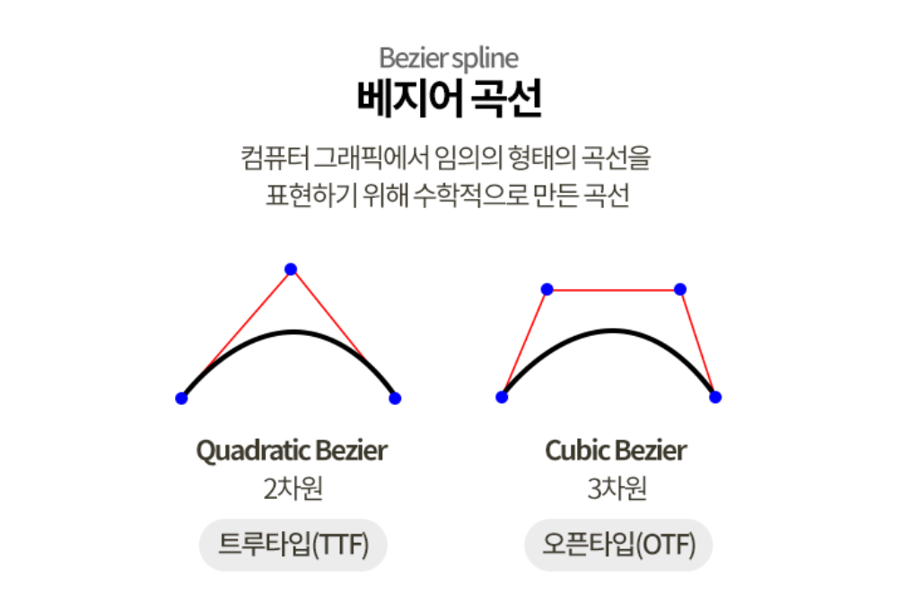

# Adobe Illustrator

  - 보통 한장짜리 그림을 그릴 때 사용
  - 벡터 방식 이미지를 사용한다. 픽셀 형식(비트맵 이미지)이 아니기 때문에 크기 조절을 해도 깨지지 않는다.
  - 빠르게 작업할 수 있기 때문에 아이콘이나 도형화 되어있는 벡터 방식의 그림을 그리거나 수정할 때 사용한다.
    - 포토샵과 구분되는 부분
  - 사진을 가져올 때는 임베딩을 해야 한다.
    - 임베딩 하지 않을 경우 원본의 링크가 필요하다.
  - 서체를 도형으로 변경할 수 있다. 다른 곳에서 파일 확인 시 해당 서체가 없어도 출력이 가능하다.

# CMYK vs RGB

  - CMYK : 출력용, 일반 잉크의 색상, 잉크(물감)의 혼합방식, 색을 더할수록 어두워짐(감산혼합) -> 밝은 재질에서 작업할 때 사용
    - C(Cyan), M(Magenta), Y(Yellow), K(Black 또는 Key)
  - RGB : 대부분 그림용, 빛의 혼합방식, 색을 더할수록 밝아짐(가산혼합)
    - Red, Green, Blue

# DPI vs PPI

  - DPI : Dots per Inch, 프린터 출력은 점을 기준으로 하기 때문에 해당 단위를 사용한다. 일반적으로 출력물을 만들 때 300DPI 이상을 사용한다.

  - PPI : Pixel per Inch, 디지털 이미지의 해상도를 나타낼 때는 픽셀을 기준으로 하기 때문에 해당 단위를 사용한다. 웹 디자인 이미지의 경우 기본 72PPI를 사용한다. 디스플레이의 사양에 따라가기 때문에 불필요하게 높일 필요는 없다.

# TTF vs OTF

  - TTF (True Type Font)
    - 애플이 어도비에 대항하기 위해 만든 저장 형식
    - 마이크로소프트사에 무료로 라이선스화하여 배포하였다
    - 가장 오랫동안 쓰여왔으며 일반적으로 문서를 작성할 때 사용
    - 어떠한 상황에서도 폰트가 원하는 모양으로 나올 수 있게 보정해주는 `힌트`라는 데이터를 넣을 수 있다.
      - 맥에서는 이 데이터를 무시하고 자체적으로 해석하여 출력하기 때문에 잘 사용하지 않는다.
  - OTF (Open Type Font)
    - 마이크로소프트사와 어도비가 함께 개발한 저장 형식.
    - 윈도우, 맥, 리눅스 등 모든 환경에서 화면 또는 인쇄물에 똑같은 모양을 만들어주기 위해 제작된 글꼴 저장 형식
    - 주로 그래픽 작업과 고해상도 출력이 필요한 업종의 종사자가 사용
    - 일부 파일은 윈도우 구형 프로그램에서 오류가 발생하기도 한다.
  - 가장 큰 차이점은 `곡선을 구현하는 방식`에 있다.
    - 트루타입(TTF)은 `2차원 베지어 방식`, 오픈타입(OTF)은 `3차원 베지어 방식`으로 곡선을 구현한다.
    
    - 때문에 트루타입 폰트는 일반 사용자에게 적합하고, 오픈타입 폰트는 고해상도 출력에 사용하기 적합하다. (+어도비 제품군)

---
# 참고

  - [Cygwin-Mingw-MSYS-GnuWin32](http://poquitopicante.blogspot.com/2012/08/cygwin-mingw-msys-gnuwin32-gnu.html)
  - [MinGW vs MSYS](https://gist.github.com/ReneNyffenegger/a8e9aa59166760c5550f993857ee437d)
  - [Cygwin vs Mingw](https://stackoverflow.com/questions/771756/what-is-the-difference-between-cygwin-and-mingw)
  - [Cygwin vs GnuWin32](https://stackoverflow.com/questions/10712550/difference-between-gnuwin32-and-cygwin)

[Windows Subsystem for Linux(WSL)]: https://namu.wiki/w/%EC%9C%A0%EB%8B%89%EC%8A%A4/MS%20%EC%9C%88%EB%8F%84%EC%9A%B0